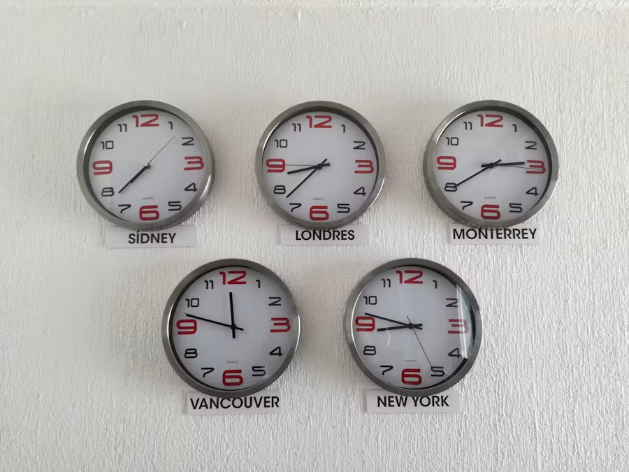
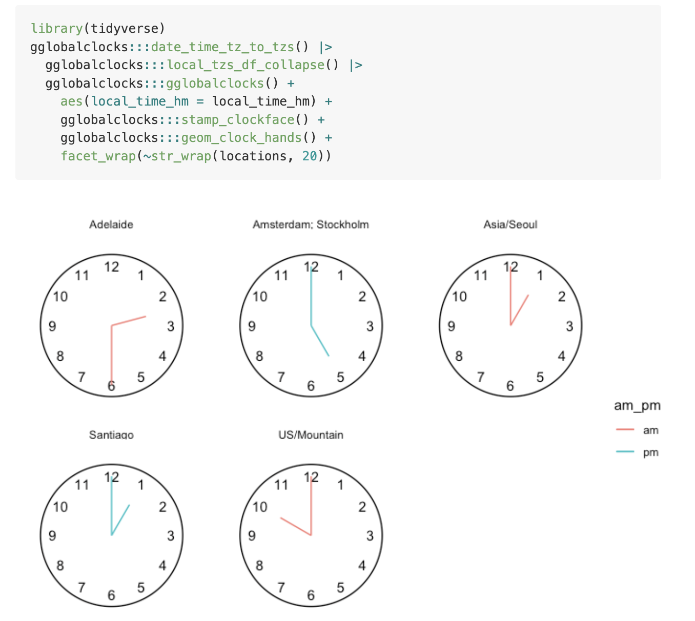
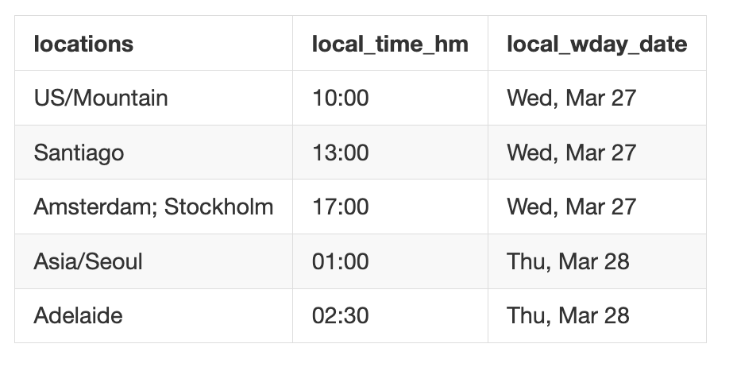
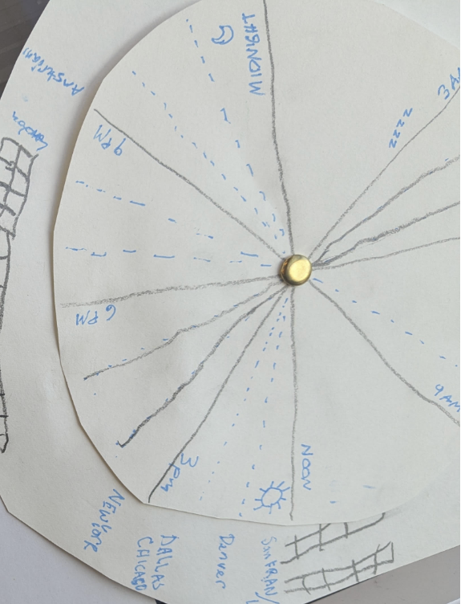
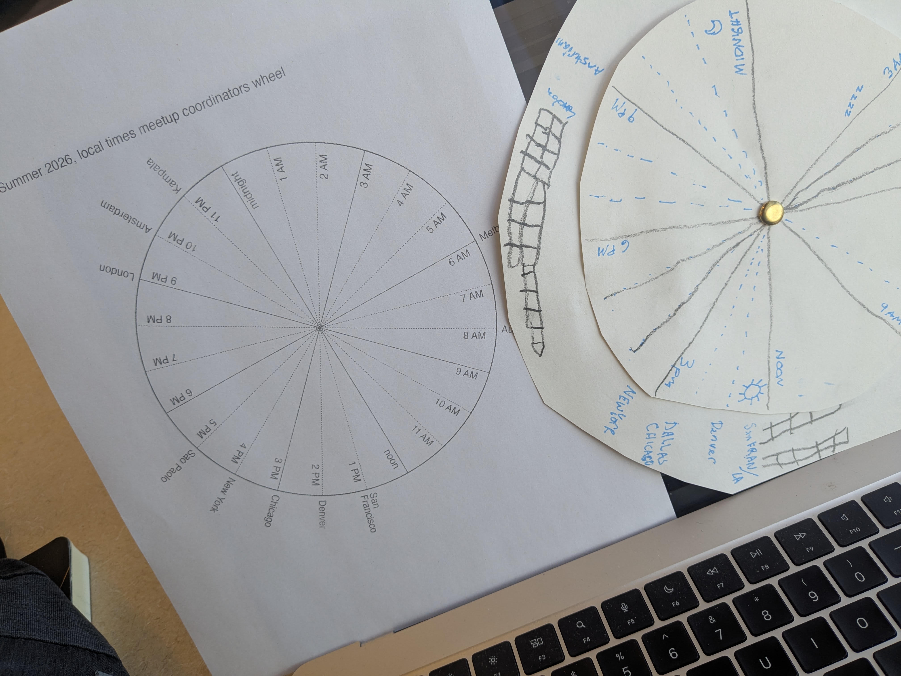

<!-- README.md is generated from README.Rmd. Please edit that file -->

```{r, include = FALSE}
knitr::opts_chunk$set(
  collapse = TRUE,
  comment = "#>",
  warning = F,
  dev = "ragg_png"
)
```

# ggtz.wheel

<!-- badges: start -->


<!-- badges: end -->


> Schreiben ist wichtig.  

When should you schedule a virtual meeting with a Melbourne based presenter 🦘, if you are hosting from Denver ⛰️, and when it is daylight savings in most of the northern hemisphere and you want folks from around the world to be able to join?  This type of question motivates the ggtz.wheel project.  

The readme for {ggtz.wheel} is especially experimental. In this README, I want to push the boundaries of the narrative-preserving package development framework 'readme-to-package' - and ask the question: 'Can we make package development even more interactive, more chatty, more fun, and much more verbose? Let's see if it can!  Schreiben ist wichtig.

The 'readme-to-package' workflow (now supported by knitrExtra) allows prose and *package* code to be intermingled (see also the literate packaging tools like litr and fusen frameworks). There may be reasons to move away from these frameworks down the road (given the almost universally accepted that the source lives - in the .R folder). But when an idea is relatively fresh, it is probably deserving of some intense prose-supported thought - some good old fashioned natural language - an amazing and powerful technology ... 🫠

So the intent is that the prose here will go well beyond explanation about what the package delivers -- the kind of prose that I'm comfortable with. Instead, the prose should live well outside of my comfort zone -- it should be blog stuff. Blog stuff that borders on self indulgent. But the thing about self-indulgent prose is... 1) maybe we shouldn't feel bad about being a little self indulgent from time to time and 2) maybe being verbose and self-indulgent could be productive -- because it's giving ourselves space to think - and even think about what we want to dedicate time to thinking about.

Restating, I wanna move away from formulaic, cookbook writing that most of my readme-to-package stuff has been, to full-on Anne Lamont and Katherine May style I-feel-something-and-I'm-gonna-put-it-on-the-page-as-best-I-can... Obviously, not with their skill - it's *my* 'as-best-I-can'.

At the same time, we'll maintain a comforting safe distance to being productive: talk about packaging practices, and write a package, and make a printable timezone wheel, plan the ggdibbler meeting, talk ggplot2 wrappers and personal taste (and try to figure out my wrapping taste even is!) and probably also talk about shiny apps.

And hopefully there, I'll check off some to-dos that have been accumulating in my mind, especially from conversations at the 2026 Joint Statistical Meeting in Boston with the ggplot2 extenders group. I've been chatting with all the folks on the WhatsApp JSM2026 group...

So ggtz.wheel. What are the precursors? It's predecessor is gglobalclocks. The idea of that project was to build a wall of clocks all set to the local times of different cities and marked with the city names. These walls are something you see in fancy hotels or, in my experience, the Illini Union at the University of Illinois. I find these walls wonderful and whimsical. They're saying: 'Let's think about all these places around the world, and the fact that they are experiencing something totally different right now.' That's fun. And when I planned international ggplot2 extenders meetups, especially those on the other side of the world these walls came to mind. And I thought a gglobalclocks visual could be a visual to show a bunch of local times around the world. Turns out, a wall of clocks visualization didn't feel like a help *whatsoever* in scheduling meetings. Perhaps scanning all the individual clocks felt like too much to take in.





What did help, and what still lives in the gglobalclocks package, were functions that took a time and location input and output a bunch of local times and locations of attendees.



And then somewhere along the line, what I thought could be a helpful visual was a timezone wheel, which I sketched out here. ☺️



And I have written some code up to make this, but it seems like it could be a candidate for a big refactor, and an occasion to think about wrapper function practices... First, let's look at the question of applying the recommendations in '' to just one other simple case: `piechart()` from the chapter programming with ggplot2.  And then we can have a look at the messier feeling case, a gg_tz_wheel case. 


# ggtz.wheel internals sketch

```{r}
library(tidyverse)
a_day <- tibble(hour = 1:24, 
       hour_pretty = rep(1:12, 2) |> 
         paste(c(rep("AM", 11), "noon",
               c(rep("PM", 11), "midnight"))) |>
         str_remove("12 "))

gglobalclocks:::date_time_tz_to_tzs(
  from_date_time = "2024-03-27 12:00:00", 
  from_tz = "US/Eastern", 
  to_tz = c("Europe/Amsterdam", "Australia/Adelaide", "Europe/Stockholm", 
            "US/Mountain", "America/Santiago", "Asia/Seoul", "Africa/Kampala")) |>
  gglobalclocks:::local_tzs_df_collapse() |> 
  mutate(hour = local_time_hm |> 
           str_extract("\\d+") |> 
           as.numeric()) 
```

```{r}
tz_wrangle <- function(from_date_time = "2024-03-27 12:00:00", 
  from_tz = "US/Eastern", 
  to_tz = c("Europe/Amsterdam", "Australia/Melbourne", "Europe/Stockholm", 
            "US/Mountain", "America/Santiago", "Asia/Seoul", "Africa/Kampala")){
  
  a_day <- tibble(hour = 1:24, 
       hour_pretty = rep(1:12, 2) |> 
         paste(c(rep("AM", 11), "noon",
               c(rep("PM", 11), "midnight"))) |>
         str_remove("12 "))

gglobalclocks:::date_time_tz_to_tzs(
  from_date_time = from_date_time, 
  from_tz = from_tz, 
  to_tz = to_tz) |>
  gglobalclocks:::local_tzs_df_collapse() |> 
  mutate(hour = local_time_hm |> 
           str_extract("\\d+") |> 
           as.numeric()) |>
  right_join(a_day, by = "hour") |> 
  arrange(-hour)
  


}
```

My current approach to this viz, is to create StatAround, which distributes things around a circle, and sets an angle that should be parallel to the spoke, and

```{r}
compute_panel_around <- function(data, scales, around_start = 0, radius = 1, x0 = 0, y0 = 0){
  
  data |> 
    mutate(row_id = row_number()) |> 
    mutate(around = - 2 * pi * row_id/n() - around_start * 2*pi / 360,
           x = radius*cos(around) + x0, 
           y = radius*sin(around) + y0,
           angle = 360*around/(2*pi),
           x0 = x0,
           y0 = y0
           )

}

StatAround <- ggproto("StatAround", Stat, 
                      compute_panel = compute_panel_around,
                      default_aes = aes(hjust = after_stat(1), 
                                        xend = after_stat(x0),
                                        yend = after_stat(y0)))


a_day <- tibble(hour = 1:24, 
       hour_pretty = rep(1:12, 2) |> 
         paste(c(rep("AM", 11), "noon",
               c(rep("PM", 11), "midnight"))) |>
         str_remove("12 "))

compute_panel_locales_around <- function(data, scales, around_start = 0, radius = 1, x0 = 0, y0 = 0, 
                                         from_date_time = Sys.Date() |> paste("09:00:00"), from_tz = Sys.timezone()){
  
  gglobalclocks:::date_time_tz_to_tzs(
    from_date_time = from_date_time, 
    from_tz = from_tz, 
    to_tz = data$tz) |>
  gglobalclocks:::local_tzs_df_collapse() |> 
  mutate(hour = local_time_hm |> 
           str_extract("\\d+") |> 
           as.numeric())  |>
  right_join(a_day, by = "hour") |> 
  arrange(hour) |> 
  compute_panel_around(scales = scales, around_start = around_start, radius = radius, x0 = x0, y0 = y0) |>
  filter_out(is.na(locations)) |> 
  mutate(PANEL = 1) # not the best, Gina, not the best...

}

StatLocalesAround <- ggproto("StatLocalesAround", Stat, 
                      compute_panel = compute_panel_locales_around,
                      default_aes = aes(hjust = after_stat(1), 
                                        label = after_stat(locations),
                                        xend = after_stat(x0),
                                        yend = after_stat(y0)))


tribble(~tz,
        "Europe/Amsterdam", 
        "Australia/Melbourne", 
        "Europe/Stockholm", 
            "US/Mountain", 
        "America/Santiago", 
        "Asia/Seoul", 
        "Africa/Kampala") |> 
  mutate(PANEL = 1) |> 
  compute_panel_locales_around()


tribble(~tz,
        "Europe/Amsterdam", 
        "Australia/Melbourne", 
        "Europe/Stockholm", 
            "US/Mountain", 
        "America/Santiago", 
        "Asia/Seoul", 
        "Africa/Kampala") |> 
  ggplot() + 
  aes(tz = tz) +
  coord_equal(ylim = c(-1.2,1.2), xlim = c(-1.2,1.2)) +
  geom_text(stat = StatLocalesAround, radius = .93) + 
  geom_text(stat = StatAround, data = a_day, inherit.aes = FALSE,
            radius = 1.025, around_start = 90,
            aes(label = hour_pretty),
            hjust = 0) + 
  geom_segment(stat = StatAround, data = a_day, inherit.aes = FALSE,
               around_start = pi/24 + 1, 
               linetype = "dotted") +
  geom_polygon(stat = StatAround, color = "darkgray", fill = NA,
               data = data.frame(x = 1:80), inherit.aes = F) + 
  labs(title = "Virtual meetup coordinators' wheel, Summer 2026",
       subtitle = "From the ggplot2 extenders ❤️") + 
  theme_void(base_size = 9, ink = "darkgray")
```

```{r}
geom_text_places <- make_constructor(GeomText, stat = StatLocalesAround, radius = .95, hjust = 1)
stamp_text_hours <- make_constructor(GeomText, stat = StatAround, radius = 1.025, hjust = 0, inherit.aes = FALSE, data = a_day, mapping = aes(label = hour_pretty))
stamp_segment_pie_cuts <- make_constructor(GeomSegment, stat = StatAround, around_start = pi/24 + 1, linetype = "dotted", inherit.aes = FALSE, data = a_day, mapping = aes(label = hour_pretty))

GeomPolygonHollow <- ggproto("GeomPolygonHollow", GeomPolygon,
                             default_aes = GeomPolygon$default_aes |> 
                               modifyList(aes(color = from_theme(ink), fill = NA)))

stamp_polygon_circle <- make_constructor(GeomPolygonHollow, stat = StatAround, data = data.frame(x = 1:200), inherit.aes = FALSE)

theme_timezone_wheel <- function(...){
  
  theme_void(base_size = 9, ink = "grey20", ...)
  
}


coord_equal_padded <- function(...){coord_equal(ylim = c(-1.2,1.2), 
                                                xlim = c(-1.2,1.2), ...)}
```

```{r}
chart_tz_wheel <- function(
  mapping = aes(),
  .coord = coord_equal_padded(),
  .geom.text.places = geom_text_places(), 
  .stamp.segment.pie.cuts = stamp_segment_pie_cuts(),
  .stamp.polygon.circle = stamp_polygon_circle(),
  .stamp.text.hours = stamp_text_hours(),
  .theme = theme_timezone_wheel(),
  .facet = NULL,
  .labs = NULL,
  .scales = list(NULL, NULL)
){
  
  list(
  .coord, 
  .stamp.segment.pie.cuts,
  .stamp.polygon.circle,
  .geom.text.places, 
  .stamp.text.hours,
  .theme, 
  .facet,
  .labs, 
  .scales
  )
  
}


# lag_around <- function(x, n){
#   
#   c(x[(n+1):length(x)], x[1:n])
#   
# }


```

## Done! (?)


```{r, eval = T}
tribble(~timezone,
        "America/Denver",
        "America/Chicago",
        "America/San_Francisco",
        "America/New_York",
        "Australia/Melbourne", 
        "Europe/Amsterdam",
        "Europe/Berlin",
        "Europe/London",
        "America/Buenos_Aires",
        "America/Santiago",
        "Africa/Kampala",
        "Pacific/Auckland") |>
  ggplot() + 
    aes(tz = timezone) + 
    chart_tz_wheel() + 
    labs(title = "Virtual meetup coordinators' wheel, Summer 2026")

OlsonNames() |> sample(20)
```


# Anatomy of wrapper functions for pies?

So what's a

The ggplot2 book models the following... <https://ggplot2-book.org/programming.html#sec-functions>

```{r}
piechart <- function(data, var) {
  ggplot(data, aes(factor(1), fill = {{ var }})) +
    geom_bar(width = 1) + 
    coord_polar(theta = "y") + 
    xlab(NULL) + 
    ylab(NULL)
}
```

But following 'plot helper functions', we wouldn't do this. Instead, we'd expose our decision as arguments. I take a few more liberties too which feel in the spirit of the plot helper functions - just maybe pushing that logic a little further:

1.  adding `.labs` and `.mapping` argument following the inclusion of arguments for other plot elements
2.  change `.geom` argument name to `.layers`, anticipating that all layers would go here - both geoms and stats
3.  break up `.scales_coord` to separate elements `.scales` and `.coord`. `list()` is used anticipating that multiple scales could be included here.

```{r}
library(ggplot2)


# or (liking this a little more)
ggpie <- function(data, 
                  mapping = NULL, 
                  .data_wrangling = identity,
                  .mapping = aes(x = factor(1)),
                  .layers = list(geom_bar(width = 1, position = "fill")), 
                  .coord = coord_polar(theta = "y"), 
                  .scales = list(NULL),
                  .labs = labs(x = NULL, y = NULL),
                  .other = NULL) {
  
  data |> 
    .data_wrangling() |> # pre-plot data transformation
    ggplot(mapping = mapping) +
    list(.mapping, .layers, .coord, .labs, .other) # bundled specification
  
}

ggpie(diamonds, aes(fill = cut))
```

In parallel you might create plot-w

```{r}
chart_pie <- function(.mapping = aes(x = factor(1)),
                  .layers = geom_bar(width = 1, position = "fill"), 
                  .coord = coord_polar(theta = "y"), 
                  .labs = labs(x = NULL, y = NULL),
                  .other = NULL){
  
     list(.mapping, .layers, .coord, .labs, .other)
  
}

diamonds |>
  ggplot() + 
  aes(fill = cut) +
  chart_pie()
```

## alternative ggpie mapped variable argument instead of mapping argument (I think this isn't as nice, do you?)

```{r}
ggpie <- function(data, 
                  fill_var, 
                  .mapping = aes(x = factor(1), fill = {{fill_var}}),
                  .layers = list(geom_bar(width = 1, position = "fill")), 
                  .scales = list(NULL),
                  .coord = coord_polar(theta = "y"), 
                  .labs = labs(x = NULL, y = NULL),
                  .other = NULL) {
  
  ggplot(data) +
    list(.mapping, .layers, .coord, .scales, .labs, .other)
  
  }


```


# gg_facet_wrap_months

```{r}
gg_facet_wrap_months <- 
  function (.events_long, date_col, locale = NULL, week_start = NULL, 
          nrow = NULL, ncol = NULL, 
          .geom = list(geom_tile(color = "grey70", fill = "transparent"), 
                       geom_text(nudge_y = 0.25)), 
          .scale_coord = list(scale_y_reverse(), 
                              scale_x_discrete(position = "top"), 
                              coord_fixed(expand = TRUE)), 
          .theme = list(theme_bw_tilecal()), 
          .other = list()) {
    
    cal_data <- calc_calendar_vars(fill_missing_units(.events_long, 
          {{date_col}}), {{date_col }})
    
    ggplot2::ggplot(
      cal_data, 
      mapping = aes_string(x = "TC_wday_label", 
                           y = "TC_month_week", label = "TC_mday")) + 
      facet_wrap(c("TC_month_label"), 
        axes = "all_x", nrow = nrow, ncol = ncol) + 
      labs(y = NULL, x = NULL) + 
      .geom + 
      .scale_coord + 
      .theme + 
      .other
}

```

```{r}
data_wrangle_facet_wrap_helper <- function(.events_long, date_col){
  
  .events_long |>
  ggtilecal::fill_missing_units(date_col = {{date_col}}) |> 
  ggtilecal::calc_calendar_vars(date_col = {{date_col}})
  
}


gg_facet_wrap_months <- 
  function (.events_long, 
            date_col, 
            locale = NULL, 
            week_start = NULL, 
            nrow = NULL, 
            ncol = NULL, 
            mapping = aes(), 
            .data_wrangling = data_wrangle_facet_wrap_helper,
            .mapping = aes(x = TC_wday_label, 
                           y = TC_month_week, 
                           label = TC_mday),
            .layers = list(geom_tile(color = "grey70", fill = "transparent"), 
                           geom_text(nudge_y = 0.25)), 
            .scales = list(scale_y_reverse(), 
                           scale_x_discrete(position = "top")),
            .coord =  coord_fixed(expand = TRUE), 
            .theme = ggtilecal::theme_bw_tilecal(),
            .labs = labs(y = NULL, x = NULL),
            .facet = facet_wrap(c("TC_month_label"), axes = "all_x", nrow = nrow, ncol = ncol),
            .other = NULL 
          ) {
    
    .events_long |> 
      .data_wrangling(date_col = {{date_col}}) |>
      ggplot(mapping = mapping) + 
      list(.mapping,
           .layers,
           .scales,
           .coord,
           .theme,
           .labs,
           .facet,
           .other)

  }


ggtilecal::make_empty_month_days(c("2024-01-05", "2024-06-30")) |>
  gg_facet_wrap_months(date_col = unit_date) 

```


