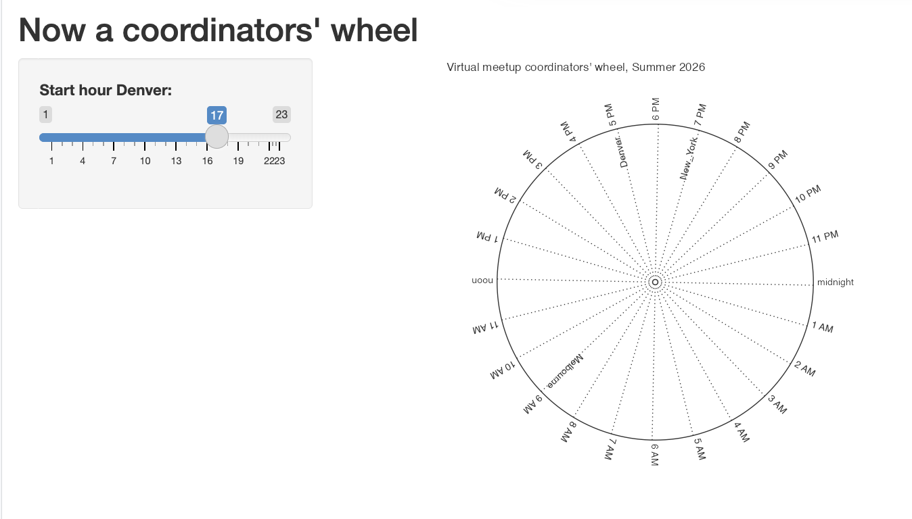
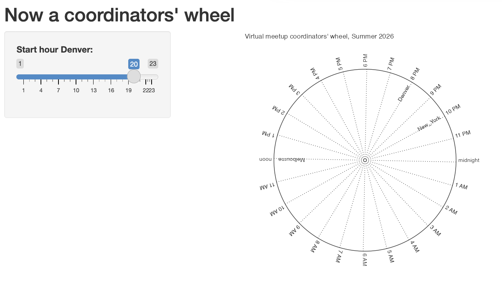

<!-- README.md is generated from README.Rmd. Please edit that file -->

```{r, include = FALSE}
knitr::opts_chunk$set(
  collapse = TRUE,
  comment = "#>",
  warning = F,
  dev = "ragg_png"
)
```

# ggtz.wheel

<!-- badges: start -->

[](https://lifecycle.r-lib.org/articles/stages.html#experimental)

<!-- badges: end -->

> Schreiben ist wichtig.

For what time should you schedule a virtual meeting with the characteristics:

-   a Melbourne based presenter 🦘,

-   you are hosting from Denver ⛰️,

-   it is daylight savings in most of the northern hemisphere

-   you want folks from around the world to be able to join?

This type of question motivates the ggtz.wheel project.

The *readme* for {ggtz.wheel} is especially experimental. In this README, I want to push the boundaries of the narrative-preserving package development framework 'readme-to-package' - and ask the question: 'Can we make package development even more interactive, more chatty, more fun, and much more verbose? Let's see if it can! Schreiben. Ist. Wichtig.

The 'readme-to-package' workflow (now supported by knitrExtra) allows prose and *package* code to be intermingled (see also the literate packaging tools like litr and fusen frameworks). There may be reasons to move away from these frameworks down the road (given the almost universally accepted that the source lives - in the .R folder). But when an idea is relatively fresh, it is probably deserving of some intense prose-supported thought - some good old fashioned natural language - an amazing and powerful technology ... 🫠

So the intent is that the prose here will go well beyond explanation about what the package delivers -- the kind of prose that I'm comfortable with. Instead, the prose should live well outside of my comfort zone -- it should be blog stuff. Blog stuff that borders on self indulgent. But the thing about self-indulgent prose is... 1) maybe we shouldn't feel bad about being a little self indulgent from time to time and 2) maybe being verbose and self-indulgent could be productive -- because it's giving ourselves space to think - and even think about what we want to dedicate time to thinking about.

Restating, I wanna move away from formulaic, cookbook writing that most of my readme-to-package stuff has been, to full-on Anne Lamont and Katherine May style I-feel-something-and-I'm-gonna-put-it-on-the-page-as-best-I-can... Obviously, not with their skill - it's *my* 'as-best-I-can'.

At the same time, we'll maintain a comforting safe distance to being productive: talk about minimal packaging practices, and write a package, and make a printable timezone wheel, plan the ggdibbler meeting, talk personal taste for ggplot2 wrappers -- and try to figure out what my wrapping taste even is, maybe think about an accompanying app for the package. Check in with the ggtime crew to see if there are better ways of tackling this!

And hopefully in so doing, I'll check off some to-dos that have been accumulating in my mind, especially from conversations at the 2026 Joint Statistical Meeting in Boston with the ggplot2 extenders group. I've been chatting with all the folks on the WhatsApp JSM2026 group...

So ggtz.wheel. Where did you come from? It's predecessor is gglobalclocks. The idea of that project was to build a wall of clocks all set to the local times of different cities and marked with the city names. These walls are something you see in fancy hotels or places like the Illini Union at the University of Illinois where I did grad school. I find these clock walls wonderful and whimsical. They're saying: 'Okay, you! let's think about all these places around the world, and the fact that they are experiencing something totally different right now.' That's fun. And when I planned international ggplot2 extenders meetups, especially those on the other side of the world these walls came to mind. And I thought a gglobalclocks visual could be a visual to show a bunch of local times around the world. As it turns out, a wall of clocks visualization didn't feel like a help *whatsoever* in scheduling meetings. Perhaps scanning all the individual clocks felt like too much to take in.


What *did* help, and what still lives in the gglobalclocks package, were functions that took a time and location input and output a bunch of local times and locations of attendees.


And then somewhere along the line, what I thought could be a helpful visual was a timezone wheel, which I sketched out here - this spinnable version made it feel like I could not only communicate timezones for a planned meeting, but also help you figure our the set of local times that might work! ☺️


I wrote some code up for a first draft - first with polar coords and then with cartesian (w equal aspect ratio), [here]() link needed but it seems like it could be a candidate for a big refactor, and an occasion to think about wrapper function practices, one of the topics of the proposed ggplot2 extenders and best practices materials discussed in Boston.

So we'll first take a bit of detour - looking. let's look at the question of applying the recommendations in 'Design Principles for Plot Helper Functions' to just one other simple case: `piechart()` from the chapter programming with ggplot2. The central thesis of 'Design Principles' is don't try to deliver a bunch of within-component 'nobs' as arguments in your wrapper function, instead, the components themselves should be exposed as argments. This should be better for function authors (who then don't need to be concerned with which component-level 'nobs' should be exposed), and better for users, who won't need to guess where a myriad of arguments might take effect within the underlying grammar. It's insightful stuff.

So we'll look at applying a version of this (more my taste than following to the letter what's modeled in 'Design Principles). And then we can have a look at the messier feeling case, creating `chart_tz_wheel`.

# Anatomy of wrapper functions for pies?

The ggplot2 book models the following... <https://ggplot2-book.org/programming.html#sec-functions>

```{r}
piechart <- function(data, var) {
  ggplot(data, aes(factor(1), fill = {{ var }})) +
    geom_bar(width = 1) + 
    coord_polar(theta = "y") + 
    xlab(NULL) + 
    ylab(NULL)
}
```

But following 'plot helper functions', we wouldn't do this. Instead, we'd expose our decision as arguments. I take a few more liberties too which feel in the spirit of the plot helper functions - just maybe pushing that logic a little further. Ideas have been sharped via the generous discussion

1.  adding `.labs` and `.mapping` argument following the inclusion of arguments for other plot elements
2.  change `.geom` argument name to `.layers`, anticipating that all layers would go here - both geoms and stats
3.  break up `.scales_coord` to separate elements `.scales` and `.coord`. `list()` is used anticipating that multiple scales could be included here.

```{r}
library(ggplot2)

# or (liking this a little more)
ggpie <- function(data, 
                  mapping = aes(), 
                  #.data_wrangling = identity,
                  .mapping = aes(x = factor(1)),
                  .layer1 = geom_bar(width = 1, position = "fill"), 
                  .coord = coord_polar(theta = "y"), 
                  .labs = labs(x = NULL, y = NULL),
                  .other = NULL) {
  
  data |> 
    #.data_wrangling() |> # pre-plot data transformation
    ggplot(mapping = mapping) +
    list(.mapping, .layer1, .coord, .labs, .other) # bundled specification
  
}

ggpie(diamonds, aes(fill = cut))
```

In parallel you might create a `chart_*()` function that is designed to

```{r}
chart_pie <- function(mapping = aes(), 
    .mapping = aes(x = factor(1)),
    .layer1 = geom_bar(mapping = mapping, width = 1, position = "fill"), 
    .coord = coord_polar(theta = "y"), 
    .labs = labs(x = NULL, y = NULL),
    .other = NULL){
  
     list(.mapping, .layer1, .coord, .labs, .other)
  
}

diamonds |>
  ggplot() + 
  aes(fill = cut) +
  chart_pie()


diamonds |>
  ggplot() + 
  chart_pie(aes(fill = cut))
```

# An alternative for ggpie is to follow more closely with the book, and provide 'fill_var'. (I think this isn't as nice, do you?)

<details>

```{r}
ggpie <- function(data, 
                  fill_var, 
                  .mapping = aes(x = factor(1), fill = {{fill_var}}),
                  .layer1 = geom_bar(width = 1, position = "fill"), 
                  .coord = coord_polar(theta = "y"), 
                  .labs = labs(x = NULL, y = NULL),
                  .other = NULL) {
  
  ggplot(data) +
    list(.mapping, .layers, .coord, .scales, .labs, .other)
  
  }
```

</details>

# A wrapper that supports concise timezone wheels code

For better of for worse, I decided to write a couple of Stats instead of taking the data pre-processing approach described in 'Design Principles'. So the wrapping task is more like ggpie (no data preprocessing) than gg_facet_wrap_months (preprocessing). The Stats and resulting layers have flaws 😢, but are at a point that allows us to look at the wrapping task.

# A peek at how some of the underlying compute works

<details>

```{r}
library(tidyverse)
a_day <- tibble::tibble(hour = 1:24, 
       hour_pretty = rep(1:12, 2) |> 
         paste(c(rep("AM", 11), "noon",
               c(rep("PM", 11), "midnight"))) |>
         stringr::str_remove("12 "))

gglobalclocks:::date_time_tz_to_tzs(
  from_date_time = "2024-03-27 12:00:00", 
  from_tz = "US/Eastern", 
  to_tz = c("Europe/Amsterdam", "Australia/Adelaide", "Europe/Stockholm", 
            "US/Mountain", "America/Santiago", "Asia/Seoul", "Africa/Kampala")) |>
  gglobalclocks:::local_tzs_df_collapse() |> 
  mutate(hour = local_time_hm |> 
           str_extract("\\d+") |> 
           as.numeric()) 
```

We'll actually clone the code from gglobalclocks...

```{r date_time_tz_to_tzs}
# cloning from gglobalclocks 🤷‍♀️
time_to_local <- function (x, tz) {
    lubridate::with_tz(x, tz = tz) %>% as.character()
}

date_time_tz_to_tzs <- function (from_date_time = "2024-03-27 12:00:00", from_tz = "US/Eastern", 
    to_tz = c("Europe/Amsterdam", "Australia/Adelaide", "Europe/Stockholm", 
        "US/Mountain", "America/Santiago", "Asia/Seoul")) 
{
    meeting <- ymd_hms(from_date_time, tz = from_tz)
    OlsonNames() %>% data.frame(tz = .) %>% dplyr::filter(tz != 
        "US/Pacific-New") %>% dplyr::filter(tz %in% to_tz) %>% 
        dplyr::mutate(local_date_time_chr = purrr::map2(meeting, 
            tz, time_to_local)) %>% tidyr::unnest(local_date_time_chr) %>% 
        dplyr::mutate(local_date_time_utc = lubridate::ymd_hms(local_date_time_chr, 
            tz = "UTC")) %>% dplyr::mutate(local_time_hms = hms::as_hms(local_date_time_utc)) %>% 
        dplyr::mutate(local_time_hm = local_time_hms %>% str_remove("...$")) %>% 
        dplyr::mutate(local_date = as.Date(local_date_time_chr)) %>% 
        dplyr::mutate(local_wday = lubridate::wday(local_date, 
            label = T)) %>% dplyr::arrange(local_date, local_time_hm) %>% 
        dplyr::select(-local_date_time_chr) %>% dplyr::mutate(local_wday_date = paste0(local_wday, 
        ", ", month(local_date, label = T), " ", day(local_date)))
}


local_tzs_df_collapse <- function (local_tzs_df, collapse = "; ") 
{
    select(select(mutate(arrange(mutate(select(ungroup(summarise(group_by(local_tzs_df, 
        local_date, local_date_time_utc, local_time_hm, local_wday_date), 
        locations = paste(tz, collapse = collapse))), locations, 
        everything()), locations = str_remove_all(locations, 
        "Europe/|America/|Australia/")), local_date_time_utc), 
        locations = fct_inorder(locations)), -local_date), everything(), 
        local_date_time_utc)
}

```

```{r}
tz_wrangle <- function(from_date_time = "2024-03-27 12:00:00", 
  from_tz = "US/Eastern", 
  to_tz = c("Europe/Amsterdam", "Australia/Melbourne", "Europe/Stockholm", 
            "US/Mountain", "America/Santiago", "Asia/Seoul", "Africa/Kampala")){
  
  a_day <- tibble(hour = 1:24, 
       hour_pretty = rep(1:12, 2) |> 
         paste(c(rep("AM", 11), "noon",
               c(rep("PM", 11), "midnight"))) |>
         str_remove("12 "))

date_time_tz_to_tzs(
  from_date_time = from_date_time, 
  from_tz = from_tz, 
  to_tz = to_tz) |>
  local_tzs_df_collapse() |> 
  mutate(hour = local_time_hm |> 
           str_extract("\\d+") |> 
           as.numeric()) |>
  right_join(a_day, by = "hour") |> 
  arrange(-hour)

}
```

</details>

# StatAround and StatLocalesAround definitions

My current approach to this viz, is to create StatAround, which distributes things around a circle, and sets an angle that should be parallel to the spoke, and StatLocalesAround.

<details>

```{r StatLocalesAround}
#' @export
compute_panel_around <- function(data, scales, around_start = 0, radius = 1, x0 = 0, y0 = 0){
  
  data |> 
    mutate(row_id = dplyr::row_number()) |> 
    mutate(around = - 2 * pi * row_id/dplyr::n() - around_start * 2*pi / 360,
           x = radius*cos(around) + x0, 
           y = radius*sin(around) + y0,
           angle = 360*around/(2*pi),
           x0 = x0,
           y0 = y0
           )

}

#' @export
StatAround <- ggplot2::ggproto("StatAround", ggplot2::Stat, 
                      compute_panel = compute_panel_around,
                      default_aes = ggplot2::aes(hjust = ggplot2::after_stat(1), 
                                        xend = ggplot2::after_stat(x0),
                                        yend = ggplot2::after_stat(y0)))


a_day <- tibble::tibble(hour = 1:24, 
       hour_pretty = rep(1:12, 2) |> 
         paste(c(rep("AM", 11), "noon",
               c(rep("PM", 11), "midnight"))) |>
         stringr::str_remove("12 "))

#' @export
compute_panel_locales_around <- function(data, scales, around_start = 0, radius = 1, x0 = 0, y0 = 0, 
                                         from_date_time = Sys.Date() |> paste("09:00:00"), from_tz = Sys.timezone()){
  
  date_time_tz_to_tzs(
    from_date_time = from_date_time, 
    from_tz = from_tz, 
    to_tz = data$tz) |>
  local_tzs_df_collapse() |> 
  dplyr::mutate(hour = local_time_hm |> 
           stringr::str_extract("\\d+") |> 
           as.numeric())  |>
  dplyr::right_join(a_day, by = "hour") |> 
  dplyr::arrange(hour) |> 
  compute_panel_around(scales = scales, 
                       around_start = around_start, 
                       radius = radius, 
                       x0 = x0, 
                       y0 = y0) |>
  dplyr::filter_out(is.na(locations)) |> 
  dplyr::mutate(PANEL = 1) # not the best, Gina, not the best...

}

#' @export
StatLocalesAround <- ggplot2::ggproto("StatLocalesAround", ggplot2::Stat, 
                      compute_panel = compute_panel_locales_around,
                      default_aes = ggplot2::aes(hjust = ggplot2::after_stat(1), 
                                        label = ggplot2::after_stat(locations),
                                        xend = ggplot2::after_stat(x0),
                                        yend = ggplot2::after_stat(y0)))
```

```{r}
tribble(~tz,
        "Europe/Amsterdam", 
        "Australia/Melbourne", 
        "Europe/Stockholm", 
            "US/Mountain", 
        "America/Santiago", 
        "Asia/Seoul", 
        "Africa/Kampala") |> 
  mutate(PANEL = 1) |> 
  compute_panel_locales_around()
```

</details>

# With the Stats constructed, we can pull together a plot...

```{r}
tribble(~tz,
        "Europe/Amsterdam", 
        "Australia/Melbourne", 
        "Europe/Stockholm", 
            "US/Mountain", 
        "America/Santiago", 
        "Asia/Seoul", 
        "Africa/Kampala") |> 
  ggplot() + 
  aes(tz = tz) +
  coord_equal(ylim = c(-1.2,1.2), xlim = c(-1.2,1.2)) +
  geom_text(stat = StatLocalesAround, radius = .93) + 
  geom_text(stat = StatAround, data = a_day, inherit.aes = FALSE,
            radius = 1.025, around_start = 90,
            aes(label = hour_pretty),
            hjust = 0) + 
  geom_segment(stat = StatAround, data = a_day, inherit.aes = FALSE,
               around_start = pi/24 + 1, 
               linetype = "dotted") +
  geom_polygon(stat = StatAround, color = "darkgray", fill = NA,
               data = data.frame(x = 1:80), inherit.aes = F) + 
  labs(title = "Virtual meetup coordinators' wheel, Summer 2026",
       subtitle = "From the ggplot2 extenders ❤️") + 
  theme_void(base_size = 9, ink = "darkgray")
```

# Layer definitions

To allow for greater concision, we define several convenience layers.

<details>

```{r geom_text_places}
#' @export
geom_text_places <- ggplot2::make_constructor(ggplot2::GeomText, stat = StatLocalesAround, radius = .95, hjust = 1)

#' @export
stamp_text_hours <- ggplot2::make_constructor(ggplot2::GeomText, stat = StatAround, radius = 1.025, hjust = 0, inherit.aes = FALSE, data = a_day, mapping = ggplot2::aes(label = hour_pretty))

#' @export
stamp_segment_pie_cuts <- ggplot2::make_constructor(ggplot2::GeomSegment, stat = StatAround, around_start = pi/24 + 1, linetype = "dotted", inherit.aes = FALSE, data = a_day, mapping = ggplot2::aes(label = hour_pretty))

#' @export
GeomPolygonHollow <- ggplot2::ggproto("GeomPolygonHollow", ggplot2::GeomPolygon,
                             default_aes = ggplot2::GeomPolygon$default_aes |> 
                               modifyList(ggplot2::aes(color = ggplot2::from_theme(ink), fill = NA)))

#' @export
stamp_polygon_circle <- ggplot2::make_constructor(GeomPolygonHollow, 
                                         stat = StatAround, 
                                         data = data.frame(x = 1:200), 
                                         inherit.aes = FALSE)

#' @export
theme_timezone_wheel <- function(base_size = 9, ink = "grey20", paper = "white", ...){
  
  theme_void(base_size = base_size, ink = ink, paper = paper,  ...)
  
}

#' @export
coord_equal_padded <- function(...){coord_equal(ylim = c(-1.2,1.2), 
                                                xlim = c(-1.2,1.2), ...)}
```

</details>

# The proposed wrap: `chart_tz_wheel()`

So finally we come to the proposed wrapper function composition...

```{r chart_tz_wheel}
#' @export
chart_tz_wheel <- function(
  mapping = ggplot2::aes(), 
  ...,
  .coord = coord_equal_padded(),
  .stamp.polygon.circle = stamp_polygon_circle(),
  .stamp.segment.pie.cuts = stamp_segment_pie_cuts(),
  .stamp.text.hours = stamp_text_hours(),
  .geom.text.places = geom_text_places(mapping = mapping, ...), 
  .theme = theme_timezone_wheel(),
  .other = NULL
){
  
  list(
  .coord, 
  .stamp.polygon.circle,
  .stamp.segment.pie.cuts,
  .stamp.text.hours,
  .geom.text.places, 
  .theme,
  .other
  )
  
}
```

# Test...

```{r, eval = T}
tribble(~timezone,
        "America/Denver",
        "America/Chicago",
        "America/San_Francisco",
        "America/New_York",
        "Australia/Melbourne", 
        "Europe/Amsterdam",
        "Europe/Berlin",
        "Europe/London",
        "America/Buenos_Aires",
        "America/Santiago",
        "Africa/Kampala",
        "Pacific/Auckland") |>
  ggplot() + 
    aes(tz = timezone) + 
    chart_tz_wheel() + 
    labs(title = "Virtual meetup coordinators' wheel, Summer 2026")

OlsonNames() |> sample(20)


tribble(~timezone,
        "America/Denver",
        "America/New_York",
        "Australia/Melbourne") |>
  ggplot() + 
    labs(title = "Virtual meetup coordinators' wheel, Summer 2026") + 
    chart_tz_wheel(aes(tz = timezone), from_date_time = "2026-09-02 10:00:00")
```

# Make it a minimally viable package

Okay, so far this is *just* code and prose. But I gotta make it a package if I expect anyone to play with the interface and give feedback based on that. Let's see how long it takes.

```{r, eval = F}
usethis::create_package(".")
```

Adding a lifecycle badge isn't essential to writing a minimal package but it is kind of fun and says 'I know this isn't prefect - I'm aware!'.

```{r, eval = F}
usethis::use_lifecycle_badge("experimental")
```

Then, I'm gonna pick out chunks that have code that need to be packaged - we'll send the contents of chunks to the .R folder. If you haven't been conciencious and haven't named your chunks (I hadn't) you'd be advised to at least name the chunks with the code to be packaged.

At this point too, I'm adding the `#' @export` tag, as well making my code explicit about function provenance, e.g. `ggplot2::aes()` instead of `aes()`

```{r}
knitrExtra::chunk_names_get()
```

And now we can fling the code of interest over into the R folder, by naming the code chunks of interess --- file names are based on the chunk names.

```{r}
knitrExtra::chunk_to_dir(c("StatLocalesAround", "geom_text_places", "chart_tz_wheel", "date_time_tz_to_tzs"))
```

Code flung over!

Do a package check. I usually just go for no errors - minimally viable package. There are loads of warnings and a few notes righ now... And make it a package

```{r, eval = F}
devtools::check()
devtools::install(".", upgrade = "never")
```

# Test *packaged* functions

```{r}
library(tidyverse)
tribble(~timezone,
        "America/Denver",
        "America/New_York",
        "Australia/Melbourne") |>
  ggplot() + 
    labs(title = "Virtual meetup coordinators' wheel, Summer 2026") + 
    ggtz.wheel::chart_tz_wheel(aes(tz = timezone), 
                   from_date_time = "2026-09-02 10:00:00")

```

# In Shiny

```{r, eval = F}
library(shiny)

# Define UI for application that draws a histogram
ui <- fluidPage(

    # Application title
    titlePanel("Now a coordinators' wheel"),

    # Sidebar with a slider input for number of bins 
    sidebarLayout(
        sidebarPanel(
            sliderInput("hr",
                        "Start hour Denver:",
                        min = 1,
                        max = 23,
                        value = 10, step = 1)
        ),

        # Show a plot of the generated distribution
        mainPanel(
           plotOutput("distPlot")
        )
    )
)

# Define server logic required to draw a histogram
server <- function(input, output) {

    output$distPlot <- renderPlot({

      tribble(~timezone,
        "America/Denver",
        "America/New_York",
        "Australia/Melbourne") |>
  ggplot() + 
    labs(title = "Virtual meetup coordinators' wheel, Summer 2026") + 
    chart_tz_wheel(aes(tz = timezone), 
                   from_date_time = "2026-09-02 " |> paste0(input$hr |> str_pad(width = 2),  ":00:00")
                   
                   )
      
    })
}

# Run the application 
shinyApp(ui = ui, server = server)


```



<!-- # gg_facet_wrap_months -->

<!-- ```{r} -->

<!-- gg_facet_wrap_months <-  -->

<!--   function (.events_long, date_col, locale = NULL, week_start = NULL,  -->

<!--           nrow = NULL, ncol = NULL,  -->

<!--           .geom = list(geom_tile(color = "grey70", fill = "transparent"),  -->

<!--                        geom_text(nudge_y = 0.25)),  -->

<!--           .scale_coord = list(scale_y_reverse(),  -->

<!--                               scale_x_discrete(position = "top"),  -->

<!--                               coord_fixed(expand = TRUE)),  -->

<!--           .theme = list(theme_bw_tilecal()),  -->

<!--           .other = list()) { -->

<!--     cal_data <- calc_calendar_vars(fill_missing_units(.events_long,  -->

<!--           {{date_col}}), {{date_col }}) -->

<!--     ggplot2::ggplot( -->

<!--       cal_data,  -->

<!--       mapping = aes_string(x = "TC_wday_label",  -->

<!--                            y = "TC_month_week", label = "TC_mday")) +  -->

<!--       facet_wrap(c("TC_month_label"),  -->

<!--         axes = "all_x", nrow = nrow, ncol = ncol) +  -->

<!--       labs(y = NULL, x = NULL) +  -->

<!--       .geom +  -->

<!--       .scale_coord +  -->

<!--       .theme +  -->

<!--       .other -->

<!-- } -->

<!-- ``` -->

<!-- ```{r} -->

<!-- data_wrangle_facet_wrap_helper <- function(.events_long, date_col){ -->

<!--   .events_long |> -->

<!--   ggtilecal::fill_missing_units(date_col = {{date_col}}) |>  -->

<!--   ggtilecal::calc_calendar_vars(date_col = {{date_col}}) -->

<!-- } -->

<!-- gg_facet_wrap_months <-  -->

<!--   function (.events_long,  -->

<!--             date_col,  -->

<!--             locale = NULL,  -->

<!--             week_start = NULL,  -->

<!--             nrow = NULL,  -->

<!--             ncol = NULL,  -->

<!--             mapping = aes(),  -->

<!--             .data_wrangling = data_wrangle_facet_wrap_helper, -->

<!--             .mapping = aes(x = TC_wday_label,  -->

<!--                            y = TC_month_week,  -->

<!--                            label = TC_mday), -->

<!--             .layers = list(geom_tile(color = "grey70", fill = "transparent"),  -->

<!--                            geom_text(nudge_y = 0.25)),  -->

<!--             .scales = list(scale_y_reverse(),  -->

<!--                            scale_x_discrete(position = "top")), -->

<!--             .coord =  coord_fixed(expand = TRUE),  -->

<!--             .theme = ggtilecal::theme_bw_tilecal(), -->

<!--             .labs = labs(y = NULL, x = NULL), -->

<!--             .facet = facet_wrap(c("TC_month_label"), axes = "all_x", nrow = nrow, ncol = ncol), -->

<!--             .other = NULL  -->

<!--           ) { -->

<!--     .events_long |>  -->

<!--       .data_wrangling(date_col = {{date_col}}) |> -->

<!--       ggplot(mapping = mapping) +  -->

<!--       list(.mapping, -->

<!--            .layers, -->

<!--            .scales, -->

<!--            .coord, -->

<!--            .theme, -->

<!--            .labs, -->

<!--            .facet, -->

<!--            .other) -->

<!--   } -->

<!-- ggtilecal::make_empty_month_days(c("2024-01-05", "2024-06-30")) |> -->

<!--   gg_facet_wrap_months(date_col = unit_date)  -->

<!-- ``` -->


